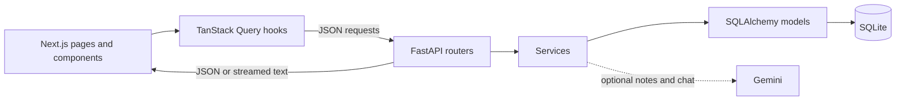
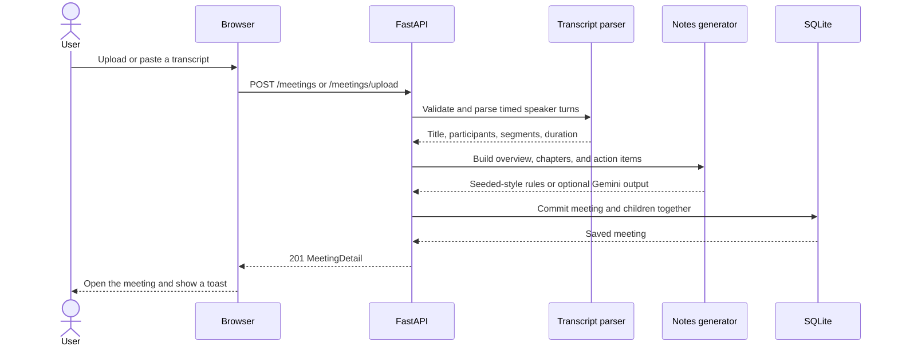
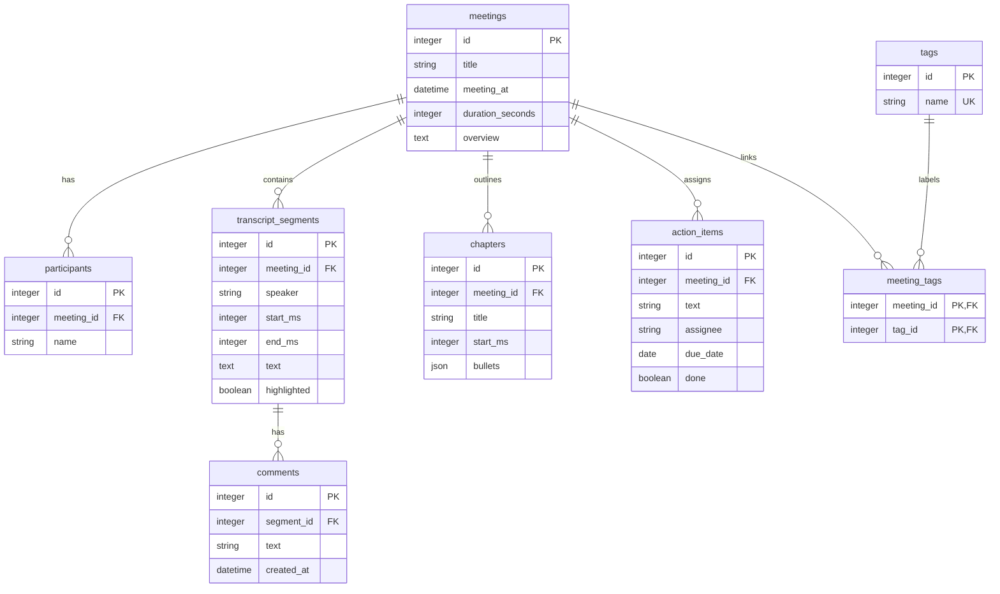

# Fireflies Clone

Built by Siddartha Nepal for the Scaler SDE fullstack assignment.

[Open the demo](https://fireflies-clone-pi.vercel.app)

A Next.js and FastAPI meeting workspace with a SQLite database. Browse meetings, search their transcripts, seek through a simulated recording, read notes, and manage action items. Eight fictional meetings are included so the app is useful on first launch.

## Run locally

Requires Node.js 20.9+ and Python 3.11+. Use two terminals.

Backend on Windows PowerShell:

```powershell
cd backend
py -m venv .venv
.\.venv\Scripts\python.exe -m pip install -r requirements-dev.txt
Copy-Item .env.example .env
.\.venv\Scripts\python.exe -m uvicorn app.main:app --reload --port 8000
```

On macOS or Linux, use `python3 -m venv .venv` and `.venv/bin/python` instead. Copy the example with `cp .env.example .env`. The virtual environment does not need to be activated.

Frontend:

```powershell
cd frontend
npm ci
Copy-Item .env.example .env.local
npm run dev
```

On macOS or Linux, use `cp .env.example .env.local`. Open [localhost:3000](http://localhost:3000). API documentation is at [localhost:8000/docs](http://localhost:8000/docs).

The API creates the tables and seeds a new database on its first start. Restarting preserves edits, new meetings, and deletions, including an empty library.

## Features

| Area              | Behavior                                                                                                                       |
| ----------------- | ------------------------------------------------------------------------------------------------------------------------------ |
| Library           | Meeting title, date, duration, participants; title search; participant, date, and tag filters; recency sorting; pagination     |
| Transcript        | Speaker labels and timestamps; click a line to seek; playback follows the active line; in-transcript search highlights matches |
| Notes             | Summary, chapters that seek to their timestamps, and editable action items                                                     |
| Management        | Upload or paste `.txt`, `.vtt`, or `.json`; edit metadata; delete meetings; add, edit, complete, and delete action items       |
| Interface         | Fireflies navigation and panels; forms, dialogs, toasts, loading, empty, and error states; responsive layout                   |
| Optional features | Global search, tags, transcript highlights and comments, Markdown/TXT export, meeting chat, dark mode                          |

Live capture, speech-to-text, authentication, integrations, sharing, analytics, skills, and voice agents are placeholders. No external meeting bot runs. Sample conversations about Hindi support or phone testing are fictional content, not implemented localization or device certification.

## Structure

```text
backend/
  app/
    routers/          HTTP endpoints
    services/         queries, parsing, notes, chat, exports
    models.py         SQLAlchemy tables
    schemas.py        Pydantic request and response types
    database.py       sessions, foreign keys, UTC handling
    config.py         environment settings
    seed.py           initial sample loading
    seed_data/        fictional meetings
  tests/              API, parser, notes, and persistence tests
frontend/
  src/app/            Next.js App Router pages
  src/components/     reusable UI and screen components
  src/lib/api/        HTTP client and TanStack Query hooks
  src/lib/hooks/      player and UI state
  src/lib/types.ts    API types
```

The browser calls FastAPI directly. Routers validate requests, services apply the rules, and SQLAlchemy reads or writes SQLite. Components use TanStack Query for server state; playback, dialogs, filters, and chat state stay in React. Next.js 15, React 19, TypeScript, Tailwind CSS v4, FastAPI, SQLAlchemy, and Pydantic make up the stack.

The UI uses Inter for body text, DM Sans for headings, a purple action color, the reference dashboard gradient, and small controls. Shared components and CSS variables keep the two themes consistent.

## How the app works



A router receives the HTTP request and validates its Pydantic schema. A service applies the rules and uses one database session. SQLAlchemy maps the rows to Python objects. FastAPI serializes the response schema, and TanStack Query updates the affected screens. A successful meeting change refreshes the library, details, filter options, and tasks together.



Playback has no audio dependency. One React clock stores the current position in milliseconds. Play opens the transcript and follows each active turn. The slider, transcript timestamps, and outline all seek that same clock. Manual scrolling pauses following; resume playback, seek, or use Back to current line to follow again.

## Database schema

Eight tables, including the tag join table. The definitions are in `backend/app/models.py`.



| Table                 | Columns and rules                                                                                                                       |
| --------------------- | --------------------------------------------------------------------------------------------------------------------------------------- |
| `meetings`            | `id` PK; `title` varchar(200); indexed UTC `meeting_at`; integer `duration_seconds`; nullable text `overview`                           |
| `participants`        | `id` PK; indexed `meeting_id` FK; `name` varchar(120)                                                                                   |
| `transcript_segments` | `id` PK; indexed `meeting_id` FK; `speaker` varchar(120); integer `start_ms` and `end_ms`; text `text`; `highlighted` defaults to false |
| `comments`            | `id` PK; indexed `segment_id` FK; `text` varchar(500); UTC `created_at`, set on creation                                                |
| `chapters`            | `id` PK; indexed `meeting_id` FK; `title` varchar(200); integer `start_ms`; JSON string list `bullets`                                  |
| `action_items`        | `id` PK; indexed `meeting_id` FK; `text` varchar(500); nullable `assignee` varchar(120) and `due_date`; `done` defaults to false        |
| `tags`                | `id` PK; unique `name` varchar(60); existing names are matched ignoring case                                                            |
| `meeting_tags`        | Composite PK (`meeting_id`, `tag_id`); both are foreign keys                                                                            |

All foreign keys use `ON DELETE CASCADE`. Deleting a meeting removes its participants, transcript, comments, chapters, tasks, and tag links. Shared tag rows remain. SQLite foreign keys are enabled for every connection; API schemas enforce text limits because SQLite does not enforce declared varchar lengths.

Meeting dates are stored in UTC and returned with a `Z`. The browser displays them in the viewer's time zone. Date filters use inclusive UTC calendar days. Task due dates have no time zone. Integer milliseconds keep playback positions aligned; duration rounds up so the last segment is fully reachable.

The summary is a meeting column because there is only one. Speakers and assignees are names because accounts and collaboration are outside the assignment. Chapter bullets are JSON because they are read together. Participant and tag lists load in batches with `selectin`, avoiding a query for every library row. Search uses escaped SQL `LIKE`, which is sufficient for a small SQLite demo.

The schema needs no queue, vector database, generic repository layer, or migration framework. Startup creates missing tables and seeds only a new database, so even deleting every meeting survives a restart. Existing-column changes require a deliberate migration; `create_all` does not perform one.

See [schema notes](docs/schema.md) and [accepted transcript formats](docs/transcript-formats.md).

## API contract

Base URL: `/api/v1`. JSON in and out, except uploaded files, downloads, and streamed chat. Interactive OpenAPI documentation is at `/docs` on the API host.

| Method and path                    | Input                                                                | Result                                                      |
| ---------------------------------- | -------------------------------------------------------------------- | ----------------------------------------------------------- |
| `GET /meetings`                    | Optional title, participant, tag, date, sort, and pagination filters | `{items: MeetingListItem[], total: number}`                 |
| `GET /meetings/filter-options`     | None                                                                 | Distinct participant names and `{name, meeting_count}` tags |
| `POST /meetings`                   | `MeetingCreate`                                                      | `201 MeetingDetail`                                         |
| `POST /meetings/upload`            | Multipart `file`, optional `title`, `meeting_at`                     | `201 MeetingDetail`                                         |
| `GET /meetings/{id}`               | Meeting ID                                                           | `MeetingDetail`                                             |
| `PATCH /meetings/{id}`             | Changed metadata fields only                                         | Updated `MeetingDetail`                                     |
| `DELETE /meetings/{id}`            | Meeting ID                                                           | `204`, no response body                                     |
| `GET /meetings/{id}/transcript`    | Meeting ID                                                           | Timed `Segment[]` with comments                             |
| `GET /meetings/{id}/export`        | `format=markdown` or `txt`                                           | Download with a title-based filename                        |
| `PATCH /segments/{id}`             | `{highlighted: boolean}`                                             | Updated `Segment`                                           |
| `POST /segments/{id}/comments`     | `{text: string}`                                                     | `201 Comment`                                               |
| `DELETE /comments/{id}`            | Comment ID                                                           | `204`                                                       |
| `GET /action-items`                | Optional `assignee`, `done`                                          | Tasks with their meeting title, newest meeting first        |
| `POST /meetings/{id}/action-items` | `{text, assignee?, due_date?}`                                       | `201 ActionItem`                                            |
| `PATCH /action-items/{id}`         | Changed `text`, `assignee`, `due_date`, or `done`                    | Updated `ActionItem`                                        |
| `DELETE /action-items/{id}`        | Action item ID                                                       | `204`                                                       |
| `GET /search`                      | Required `q`, 1-100 characters                                       | Up to 5 title matches and 20 transcript matches             |
| `POST /meetings/{id}/ask`          | `{question, history?}`                                               | Streamed plain-text Markdown from this meeting              |
| `POST /ask`                        | `{question, history?}`                                               | Streamed answer about the ten most recent meetings          |
| `GET /health`                      | None                                                                 | `{status: "ok"}`                                            |
| `GET /me`                          | None                                                                 | `{name, email}` for the configured demo user                |

### Library filters

| Parameter              | Meaning                                               |
| ---------------------- | ----------------------------------------------------- |
| `q`                    | Title contains the literal text, ignoring case        |
| `participant`          | Repeat for several names; any may match               |
| `tag`                  | Repeat for several tags; any may match                |
| `date_from`, `date_to` | Inclusive UTC days in `YYYY-MM-DD` format             |
| `sort`                 | `newest` by default, or `oldest`                      |
| `skip`, `limit`        | Offset starts at 0; limit defaults to 20 and is 1-100 |

Example: `/api/v1/meetings?q=planning&participant=Siddartha%20Nepal&sort=newest&limit=20`.

### Request and response shapes

```typescript
type MeetingListItem = {
  id: number;
  title: string;
  meeting_at: string;
  duration_seconds: number;
  participants: string[];
  tags: string[];
};
type MeetingDetail = MeetingListItem & {
  overview: string | null;
  chapters: Chapter[];
  action_items: ActionItem[];
};
type Chapter = {
  id: number;
  title: string;
  start_ms: number;
  bullets: string[];
};
type ActionItem = {
  id: number;
  meeting_id: number;
  text: string;
  assignee: string | null;
  due_date: string | null;
  done: boolean;
};
type Comment = { id: number; text: string; created_at: string };
type Segment = {
  id: number;
  speaker: string;
  start_ms: number;
  end_ms: number;
  text: string;
  highlighted: boolean;
  comments: Comment[];
};
```

Create a meeting from pasted text:

```json
{
  "title": "Launch review",
  "meeting_at": "2026-10-09T09:00:00Z",
  "participants": ["Siddartha Nepal", "Asha"],
  "transcript": {
    "format": "txt",
    "content": "Siddartha Nepal  00:00\nWe agreed to launch on Friday.\n\nAsha  00:12\nI will review the checklist tomorrow."
  }
}
```

Title, date, and participants are optional on creation. Defaults come from the transcript, current UTC time, and its speaker names. The transcript format is `txt`, `vtt`, or `json`; pasted content is limited to 2,000,000 characters. Uploaded UTF-8 files are limited to 2 MB. Names are trimmed and deduplicated ignoring case.

A meeting PATCH accepts `title`, `meeting_at`, `participants`, `tags`, and `overview`. Lists replace their saved values. Only `overview` accepts null to remove the summary; other supplied fields cannot be null. Participant names are at most 120 characters and tags at most 60. Title edits are limited to 200 characters.

Action item text and comment text are 1-500 characters. Task assignees are at most 120 characters. A task PATCH can use null to clear its assignee or due date, but cannot set its text or completion flag to null.

Chat questions are 1-1,000 characters. History accepts up to 20 `{role: "user" | "assistant", content: string}` turns of at most 4,000 characters each. The browser sends recent turns with each request; the server does not store chat history. If Gemini cannot answer before the first chunk, the demo retrieves an answer from saved meeting data. Interrupted streams identify that the answer was cut short.

Errors use `{"detail": "message"}`; FastAPI validation errors use a `detail` array. `404` means a record was not found, `413` means an oversized upload, and `422` means invalid input. Creates return `201`; deletes return `204`.

See [API examples](docs/api-spec.md) for full sample responses.

## Reading the code for an interview

Start with `app/routers/meetings.py`, then follow its calls into `services/meetings.py`, `transcript_parser.py`, and `notes.py`. The database models and request schemas show the relationships and validation separately.

On the frontend, start with `components/layout/app-shell.tsx`. `navigation.ts` holds page labels, icons, links, and placeholder flags in one place. `sidebar-header.tsx` owns the avatar/collapse interaction; `sidebar.tsx` renders navigation and its drawer. The detail page uses that same drawer. Hover previews preserve editor focus; click and keyboard opens use a native modal for focus trapping and Escape.

Next, read the Meetings page and its `lib/api/meetings.ts` hooks. Then follow `detail/meeting-view.tsx` to the notes, transcript, and `use-player.ts` clock. Reusable controls live in `components/ui`; screen components live beside the screen that uses them.

The two kinds of state stay separate: TanStack Query stores API data; React stores temporary UI choices. Sidebar width and theme are the only persistent browser preferences. Dialogs, filters, player position, and chat reset when their owning view ends.

## Assignment coverage

| Requirement          | Implemented flow                                                                                                                             |
| -------------------- | -------------------------------------------------------------------------------------------------------------------------------------------- |
| Meeting library      | Persisted sample meetings, title search, date/participant filters, recency sorting, metadata                                                 |
| Transcript detail    | Speaker labels, timestamps, shared player position, highlighted search matches                                                               |
| Summary and notes    | Overview, action items, chapters; seeded notes and rules for imports                                                                         |
| Meeting CRUD         | Paste/upload, edit title/participants, delete; changes persist in SQLite                                                                     |
| Action item CRUD     | Add, edit, complete, delete; per-meeting notes and the Tasks page                                                                            |
| Fireflies UI         | Shared navigation, hover collapse/expand, reference dashboard gradient, reading panels, modals, toasts                                       |
| Optional features    | Global search, tags, comments/highlights, Markdown/TXT exports, chat, dark mode                                                              |
| Placeholder features | Live capture, real transcription, authentication, team sharing, integrations, plans, notifications, analytics, voice agents, reusable skills |

Placeholder pages state Coming soon. Disabled controls identify it in their label or tooltip. Uploading transcripts, playback, task editing, highlights, and export are working actions and are not placeholders.

## Environment

| Variable              | Location | Default / purpose                                           |
| --------------------- | -------- | ----------------------------------------------------------- |
| `DATABASE_URL`        | Backend  | `sqlite:///./data/fireflies.db`                             |
| `CORS_ORIGINS`        | Backend  | `["http://localhost:3000"]`; JSON array of frontend origins |
| `DEMO_USER_NAME`      | Backend  | `Siddartha Nepal`; also used by My Tasks                    |
| `DEMO_USER_EMAIL`     | Backend  | `siddartha.nepal@example.com`                               |
| `GOOGLE_API_KEY`      | Backend  | Optional; enables Gemini notes and chat                     |
| `GEMINI_MODEL`        | Backend  | `gemini-flash-latest`                                       |
| `NEXT_PUBLIC_API_URL` | Frontend | `http://localhost:8000/api/v1`; embedded at build time      |

Without a key, notes use sentence selection and commitment matching, and chat retrieves information from the saved meeting data. These rules are a demo fallback and do not provide general LLM reasoning. Sample notes are already written. With a key, Gemini generates structured notes and streams chat replies. Failed or empty responses fall back to saved data; a partially interrupted reply is marked as cut short. Provider calls have a bounded timeout and clients are closed after use. Chat history is kept only in memory in the browser.

## Checks

```powershell
cd backend
.\.venv\Scripts\python.exe -m pytest -q
.\.venv\Scripts\python.exe -m ruff check .
.\.venv\Scripts\python.exe -m ruff format --check .
```

```powershell
cd frontend
npx tsc --noEmit
npm run lint
npm run build
```

GitHub Actions runs the backend checks and frontend production build. Unit tests use an isolated SQLite database and fake Gemini clients; they do not prove that a real provider key has quota or that a physical phone was tested.

## Hosting

Deploy the frontend on Vercel with `frontend` as the root directory. Set `NEXT_PUBLIC_API_URL` to the public backend URL plus `/api/v1` before building.

Deploy the API on Railway with `backend` as the root and the included Dockerfile. Set the health check to `/api/v1/health` and enable Serverless in the service settings. Attach a volume at `/data`, set `DATABASE_URL=sqlite:////data/fireflies.db`, and allow the frontend origin in `CORS_ORIGINS`. The Dockerfile runs one Uvicorn worker on Railway's `PORT`; health checks use `/api/v1/health`. Serverless sleep is enabled to reduce idle usage.

SQLite must be on persistent storage. An ephemeral backend disk or a Vercel serverless filesystem would lose saved meetings. The app assumes one API replica. Railway's free plan has limited monthly credit and can pause when it is exhausted; a free tier is not a guarantee of continuous uptime.

Schema changes require a separate data migration or a deliberate reset of a disposable database. `create_all` creates missing tables and does not migrate existing columns.
